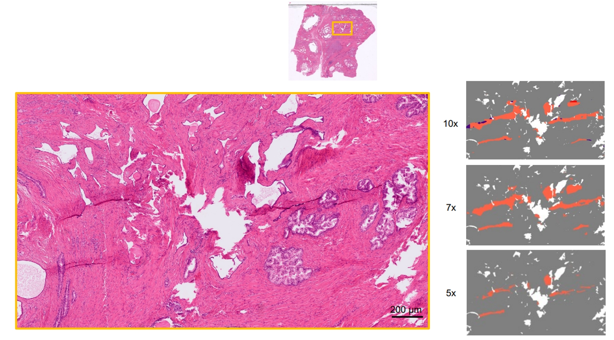
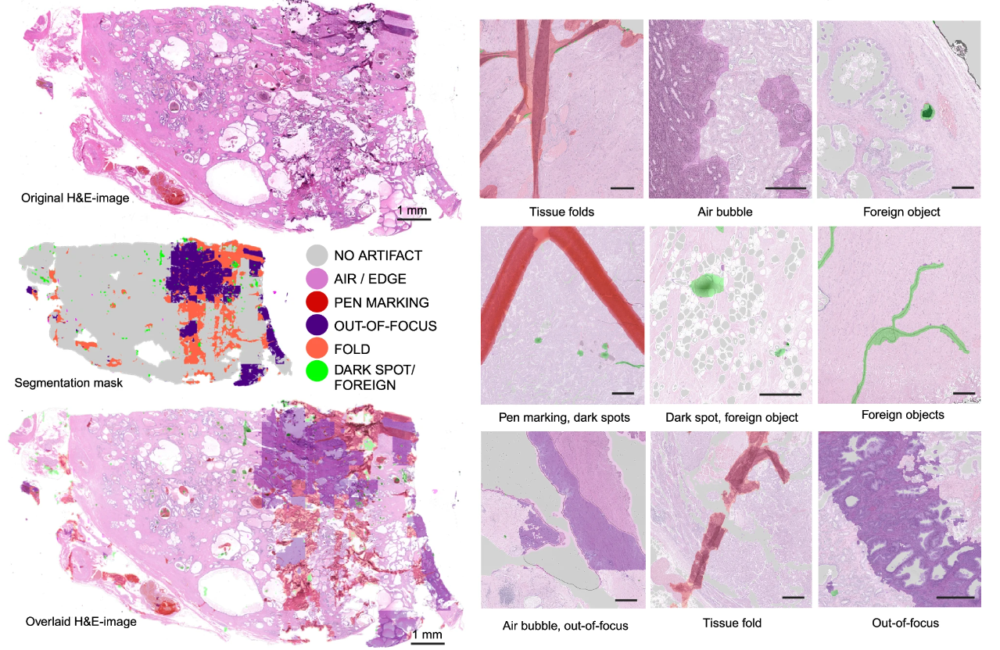

<div align="center">
  
  <div>&nbsp;</div>

</div>

<div align="center">
    
    
</div>

# GrandQC

## A comprehensive solution toquality control problem in digital pathology

*Nature Communications*

 [Journal Link](https://www.nature.com/articles/s41467-024-54769-y) | [Open Access Read Link](https://rdcu.be/d3I7H) | [Download Model](https://zenodo.org/records/14041538) | [Cite](#reference) 

**Abstract:** Histological slides contain numerous artifacts that can significantly deterioratethe performance of image analysis algorithms. Here we develop the GrandQCtool for tissue and multi-class artifact segmentation. GrandQC allows for high-precision tissue segmentation (Dice score 0.957) and segmentation of tissuewithout artifacts (Dice score 0.919–0.938 dependent on magnification). Slidesfrom 19 international pathology departments digitized with the most commonscanning systems and from The Cancer Genome Atlas dataset were used toestablish a QC benchmark, analyzing inter-institutional, intra-institutional,temporal, and inter-scanner slide quality variations. GrandQC improves theperformance of downstream image analysis algorithms. We open-source theGrandQC tool, our large manually annotated test dataset, and all QC masks forthe entire TCGA cohort to address the problem of QC in digital/computationalpathology. GrandQC can be used as a tool to monitor sample preparation andscanning quality in pathology departments and help to track and eliminatemajor artifact sources.

## Introduction

### Overview

GrandQC is an open source artifacts segmentation toolbox based on PyTorch.

The main branch works with **PyTorch 2+**. 

The System is **Ubuntu 22.04**.

<details open>
<summary>Major features</summary>

- **GrandQC Design**

  GrandQC is composed of two components: tissue segmentation and artifact segmentation. Tissue segmentation serves as the foundation for artifact segmentation, offering a more precise tissue target for detecting artifacts

- **Comprehensive Artifact Segmentation**

  GrandQC offers advanced detection of all common artifacts on segmented whole slide images (WSI), including tissue folding, pen marks, bubbles, edges, black spots, foreign objects, and out-of-focus areas. This level of coverage surpasses that of any existing open-source quality control tools.

- **High efficiency**

  For tissue segmentation, GrandQC processes a whole slide image (WSI) in an average of 0.4 seconds. Artifact segmentation takes between 27 and 45 seconds per WSI, depending on the model and magnification level.

- **Models with Different Magnifications**

  To balance efficiency and segmentation quality, GrandQC offers three models trained at different magnifications: **5x, 7x, and 10x**. Higher magnifications result in more accurate artifact segmentation but require longer processing times.

- **State of the art**

  We performed an extensive comparison with existing open-source tools, demonstrating that GrandQC significantly outperforms them across multiple metrics.

- **Building a Benchmark**
  
  We analyzed whole slide images (WSI) from various institutions and hospitals across different countries to develop a comprehensive quality benchmark. This benchmark enables each hospital and institution to evaluate their tissue slide preparation processes and make targeted improvements.

- **Scanner Selection Assistant**
  
  GrandQC allows for direct comparison of different scanners by analyzing the same batch of tissue slides. This helps in identifying the strengths and weaknesses of each scanner, particularly in relation to out-of-focus issues.

</details>

### Model selection

To balance accuracy and inference efficiency, we have trained three different models based on three magnifications (5x, 7x, and 10x). As the magnification decreases, the inference speed increases, but accuracy may be slightly affected. Users can choose the appropriate 
model based on their specific requirements.

Here is an example of one ROI(Region of Interest) image from one Whole Slide Image:

<div align="center">
  
</div>

### Model Output

GrandQC is designed to segment tissue, background, and five different types of artifacts, including: Air Bubble & Slide Edge, Pen Marking, Out of Focus, Fold, and Dark Spot & Foreign. In the final model output, white represents tissue, black represents background, 
and the five types of artifacts are displayed in distinct colors, as shown in the example below.

<div align="center">
  
</div>

## Installation

### Install Dependencies
> conda create -n grandqc python==3.10 -y && conda activate grandqc
> 
> git clone https://github.com/cpath-ukk/grandqc.git && cd grandqc
> 
> pip install -r requirements.txt

### Install Openslide
> conda install -c conda-forge openslide openslide-python

## How to use different versions (5x ,7x, 10x)

**We have released all the models on Zenodo**: 

Artifacts Detection Models: [Models](https://zenodo.org/records/14041538)

Tissue Detection Models: [Model](https://zenodo.org/records/14507273)


The default version is 7x (Checkpoint: GrandQC_MPP15.pth)

To use 5x and 10x checkpoints, the `main.py` script should be modified.

For 5x, use:

```commandline
MODEL_QC_NAME = 'GrandQC_MPP2.pth'
MPP_MODEL = 2
```
For 10x, use:

```commandline
MODEL_QC_NAME = 'GrandQC_MPP1.pth'
MPP_MODEL = 1
```


### For WSIs with the form of `.svs` (Leica), `.ndpi` (Hamamatsu), `.tiff` (Philips)

Fot this case, you need to use the scripts in `01_WSI_inference_OPENSLIDE_QC`:

```commandline
cd 01_WSI_inference_OPENSLIDE_QC
```

- Tissue Segmentation

Before running the Tissue-Segmentation script, you need to define the slides path **SLIDE_FOLDER** and **OUTPUT_DIR** in `run_tis.sh` first and then run:
```commandline
sh run_tis.sh
```

- Artifacts Segmentation

Similar to the Tissue Segmentation, before running the Artifacts-Segmentation script, you need to define the slides path **SLIDE_FOLDER** and **OUTPUT_DIR** in `run_art.sh` first and then run:

```commandline
sh run_art.sh
```

### For WSIs with the form of `ome.tiff`

Fot this case, you need to use the scripts in `02_WSI_inference_OME_TIFF_QC`:

```commandline
cd 02_WSI_inference_OME_TIFF_QC
```

abd then same as the usage above.

## Citation

If you use GrandQC or benchmark in your research, please consider citing our [paper](https://www.nature.com/articles/s41467-024-54769-y)

Weng Z. et al. "GrandQC: a comprehensive solution to quality control problem in digital pathology"

Nature Communications(2024). https://doi.org/10.1038/s41467-024-54769-y

```
@article{Weng2024,
  author = {Weng, Zhilong and Seper, Alexander and Pryalukhin, Alexey and Mairinger, Fabian and Wickenhauser, Claudia and Bauer, Marcus and Glamann, Lennert and Bläker, Hendrik and Lingscheidt, Thomas and Hulla, Wolfgang and Jonigk, Danny and Schallenberg, Simon and Bychkov, Andrey and Fukuoka, Junya and Braun, Martin and Schömig-Markiefka, Birgid and Klein, Sebastian and Thiel, Andreas and Bozek, Katarzyna and Netto, George J. and Quaas, Alexander and Büttner, Reinhard and Tolkach, Yuri},
  title = {GrandQC: A comprehensive solution to quality control problem in digital pathology},
  journal = {Nature Communications},
  year = {2024},
  pages = {10685},
  doi = {10.1038/s41467-024-54769-y},
  url = {https://doi.org/10.1038/s41467-024-54769-y},
  issn = {2041-1723}
  }
```

## License

This project is released under the [Creative Commons Attribution-NonCommercial-ShareAlike 4.0 International License](https://creativecommons.org/licenses/by-nc-sa/4.0/).
